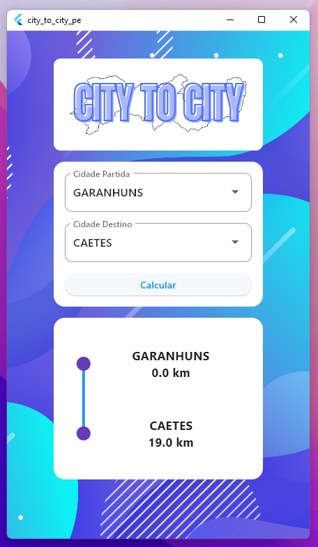

Aplicativo Flutter para aplicar o uso de grafos, onde poderá ser selecionado 2 cidades de Pernambuco e é calculado a distância entre elas usando o algoritmo de Dijkstra para calcular o menor caminho.

### :construction: Status do Projeto
Em andamento

10/185 cidades adicionadas.

### Download 
1. Clique Aqui -> [App City To City PE.apk](https://github.com/alexlsilva7/city_to_city_pe/blob/cab1fcc51e49d71a378c24d9e5070a6fba103743/assets/readme/city-to-city%2001.apk)
2. E depois clique em Download.
